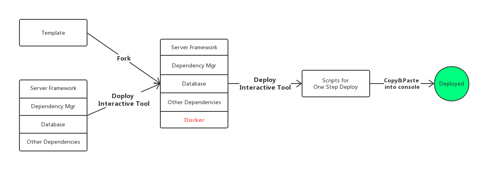

# Doploy

Doploy is a Docker-based configuration tool that helps 
deploy the backend of a web application in a faster and simpler way.

## Description

- Doploy encapsulates a traditional web-backend code base 
into a product that can be deployed to any machine within 
one step, with the help of [Docker](https://www.docker.com/).

- Doploy works as a blackbox. Background knowledge about Docker, Shell language, 
or deployment techniques is not required.

- [Interactive Doploy Tool](https://www.do-ploy.com/doploy) 
will help you work out all the deployment problems.

## Template Menu
Templates here work for greenfield projects. You can easily find popular tech stacks for web backend here.
Select the one that you're interested in and build your project without problems of deployment!

- [Flask + PostgreSQL](https://github.com/AlanDelip/Doploy/tree/flask-postgresql)
- [Express + MongoDB](https://github.com/AlanDelip/Doploy/tree/express-mongo)
- [Springboot + MySQL](https://github.com/AlanDelip/Doploy/tree/springboot-mysql)

## Keep In Touch
- Clone / Fork / Star are warmly welcomed
- Discussions in issues are warmly welcomed
- Visit my [homepage](https://www.alan-zhufengxu.com) for more top-notch projects 